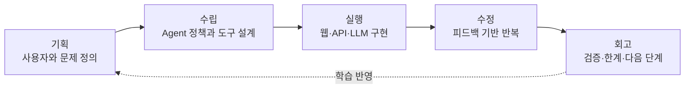
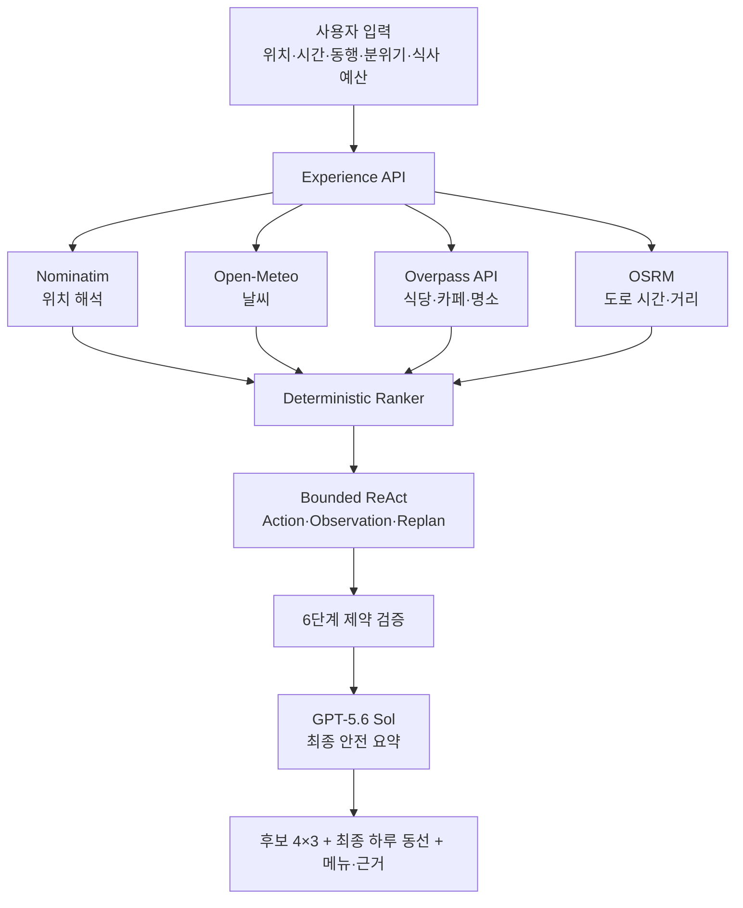

# YUYEONG — 오늘의 경험을 설계하는 AI Agent

<p align="center">
  
</p>

> 점심, 카페, 저녁, 드라이브를 따로 추천하지 않고 사용자의 취향·시간·날씨·예산·실제 이동시간을 함께 판단해 **오늘의 경험 전체**를 하나의 동선으로 설계하는 웹 기반 AI Agent입니다.

[비공개 Live Demo](https://yuyeong-agent.jisoo584983761.chatgpt.site) · [기술스택 Notebook](portfolio/yuyeong_tech_stack.ipynb)

## 프로젝트 요약

| 항목 | 내용 |
| --- | --- |
| 프로젝트명 | YUYEONG(유영) |
| 형태 | Full-stack AI Agent 웹앱 |
| 핵심 모델 | OpenAI `gpt-5.6-sol` · Responses API |
| 핵심 가치 | 장소 목록이 아닌 실행 가능한 하루의 경험 설계 |
| 주요 사용자 | 연인·친구·혼자 보내는 하루를 자연스럽게 계획하고 싶은 사람 |
| 주요 결과 | 식당 4곳, 카페 4곳, 20분 이상 드라이브 4곳을 비교한 뒤 최종 동선 구성 |
| 배포 | OpenAI Sites 비공개 프로덕션 |

## Pipeline



---

## 1. 기획 — 무엇을 해결하려 했는가

### 배경

맛집, 카페, 드라이브 장소를 찾는 서비스는 많지만 좋은 장소들을 **어떤 순서로 연결해야 하루가 자연스러운지**는 여전히 사용자가 결정해야 합니다. 특히 데이트에서는 다음 조건들이 서로 영향을 줍니다.

- 누구와 함께하는가
- 오늘 원하는 분위기는 무엇인가
- 몇 시에 시작하고 끝내야 하는가
- 점심과 저녁 식사 예산은 얼마인가
- 날씨와 이동수단은 무엇인가
- 카페 이후 저녁, 저녁 이후 드라이브까지 이동이 자연스러운가
- 추천 근거가 실제 데이터인지 추론인지 구분되는가

### 문제 정의

> 사용자는 장소 12곳을 직접 비교하고 조합하고 싶어 하는 것이 아니라, 자신의 조건을 이해한 Agent가 검증 가능한 후보를 비교해 **실행 가능한 하루 한 개**를 만들어주길 원한다.

### 사용자 성향에서 출발한 제품 방향

YUYEONG은 새로운 경험을 두려워하지 않으면서도 편안한 하루, 좋은 식사, 분위기 있는 카페, 드라이브를 사랑하는 사용자의 실제 취향에서 시작했습니다.

- 계획은 세우되 계획이 달라져도 유연하게 받아들임
- 사람과 함께 커피와 식사를 즐기는 경험을 선호함
- 익숙함과 새로움 사이의 균형을 원함
- 이해되지 않는 추천은 근거를 확인하고 싶어 함
- 연인과 함께 설렐 수 있는 식사와 분위기를 중요하게 생각함

### 목표와 비목표

| 목표 | 비목표 |
| --- | --- |
| 하루 전체를 하나의 시간표와 동선으로 연결 | 별점 순 장소 목록만 제공 |
| 공개 데이터와 추론을 분리해 설명 | 확인되지 않은 가격·영업·분위기를 사실처럼 표현 |
| 실패한 도구를 숨기지 않고 안전하게 폴백 | 무한 재시도 또는 조용한 실패 |
| 점심·저녁 식당 각각에 2인 식사비 적용 | 카페·드라이브까지 포함한 총 데이트 비용 계산 |
| 실제 도로 이동시간을 이용한 드라이브 검증 | 직선거리만 보고 20분 이상이라고 단정 |

### 왜 Agent인가

일반 추천은 `질문 → 답변`으로 끝나지만 YUYEONG은 목표를 달성할 때까지 다음 과정을 수행합니다.

1. 사용자의 모호한 바람을 제약조건으로 바꿉니다.
2. 위치·날씨·장소·도로 경로 도구를 호출합니다.
3. 후보를 랭킹하고 서로 다른 활동을 하나의 순서로 연결합니다.
4. 후보 수, 중복, 경로 구간, 시간, 예산, 드라이브 최소시간을 검산합니다.
5. 제약이 약하면 검색 범위를 한 번 확장해 재계획합니다.
6. 사실, 설계 판단, 아직 알 수 없는 정보를 분리해 보고합니다.

---

## 2. 수립 — Agent를 어떻게 설계했는가

### 시스템 구조



### 6단계 사고 검증 시스템

내부 사고의 원문(Chain-of-Thought)은 노출하지 않습니다. 대신 검증 가능한 단계별 요약과 도구 결과만 공개합니다.

| 단계 | 역할 | 주요 검증 |
| --- | --- | --- |
| 1. REQUEST | 요청 정규화 | 위치, 시간, 동행, 분위기, 활동, 식사 예산 |
| 2. GROUND | 외부 사실 수집 | 좌표, 날씨, 장소 이름, 도로 경로 |
| 3. FILTER | 후보 정제 | 이름·좌표 확인, 중복 제거, 카테고리별 후보 수 |
| 4. PLAN | 동선 생성 | 점심 → 카페 → 저녁 → 드라이브 연결 |
| 5. VERIFY | 반증과 검산 | 활동 수, 경로 구간, 종료시간, 4개 후보, 드라이브 20분 |
| 6. REPORT | 안전한 응답 | FACT·INFERENCE·UNKNOWN 분리 |

### Bounded ReAct

```text
Reason(private) → Action → Observation → Adapt/Replan → Verify → Stop
```

- 공개되는 것: 사용한 도구, 관찰 결과, 재계획 여부, 최종 결정 요약
- 공개하지 않는 것: 모델의 원시 내부 사고 과정
- 재계획 제한: 검색 반경을 실제로 변경하는 경우에만 제한적으로 수행
- 종료 조건: 필수 제약을 모두 통과하거나 복구 가능한 오류를 반환

### 핵심 도메인 규칙

#### 식사 예산

- 예산은 **점심 식당 한 곳과 저녁 식당 한 곳에 각각** 적용됩니다.
- 기준은 항상 `식당 1곳 · 2인 식사비`입니다.
- 카페, 드라이브, 주차, 연료비, 총 데이트 비용에는 영향을 주지 않습니다.
- 공개 데이터만으로 실제 가격을 확인할 수 없으므로 예산은 랭킹 조건이며, 최종 가격은 메뉴 링크에서 확인하도록 안내합니다.

#### 후보 수

- 요청된 카테고리마다 중복 없는 후보를 정확히 4곳 제공합니다.
- 식당 4곳, 카페 4곳, 드라이브 4곳을 보여준 뒤 최종 동선에 채택된 장소를 별도로 표시합니다.
- 식당 후보에서는 등록 메뉴 또는 메뉴 검색 링크를 제공합니다.

#### 드라이브

- 이전 일정 지점에서 후보까지의 차량 이동시간을 OSRM 도로 경로로 계산합니다.
- **20분 미만 후보는 제거**합니다.
- 4개 후보를 확보하지 못하면 결과를 억지로 채우지 않고 검색 반경을 확장하거나 오류를 반환합니다.
- 도로 경로 도구가 실패해 추정값을 사용하면 `estimated`로 명확히 표시합니다.

#### Hallucination 방지

- 도구가 반환하지 않은 별점, 가격, 혼잡도, 현재 영업 여부, 예약 가능 여부를 생성하지 않습니다.
- 분위기, 고급스러움, 데이트 적합성은 공개 메타데이터 기반 탐색 신호로만 표현합니다.
- 메뉴 데이터가 없으면 음식 유형 예시와 외부 확인 링크만 제공합니다.
- LLM 호출이 실패해도 결정론적 검증 결과를 유지하고 상태를 `fallback`으로 공개합니다.

---

## 3. 기술스택·실행 — 무엇으로 어떻게 만들었는가

### 기술스택

| 영역 | 기술 | 사용 목적 |
| --- | --- | --- |
| Language | TypeScript 5.9 | 엄격한 타입 기반 프론트엔드·API 구현 |
| UI | React 19.2 | 입력 폼, 후보 보드, ReAct·감사 UI, 동선·메뉴 화면 |
| Framework | Next.js 16.2 + vinext 0.0.50 | App Router 구조와 Cloudflare 호환 빌드 |
| Build | Vite 8 | 빠른 개발 서버와 프로덕션 번들 |
| LLM | GPT-5.6 Sol | 검증된 사실만 이용한 최종 제약·근거 요약 |
| LLM API | OpenAI Responses API | 서버 측 모델 호출 |
| Place Data | OpenStreetMap + Overpass API | 식당, 카페, 공원, 정원, 전망 포인트 후보 |
| Geocoding | Nominatim | 사용자의 장소 문자열을 좌표로 변환 |
| Weather | Open-Meteo | 현재 기온, 체감온도, 강수 가능성 |
| Routing | OSRM Route·Table API | 전체 동선과 드라이브 후보의 도로 시간·거리 계산 |
| Hosting | OpenAI Sites | 비공개 프로덕션 배포와 비밀 환경변수 관리 |
| Test | Node.js test runner | 서버 렌더링, 기능 계약, 안전 정책 회귀 테스트 |

상세 기술스택과 저장소 진단 코드는 [`portfolio/yuyeong_tech_stack.ipynb`](portfolio/yuyeong_tech_stack.ipynb)에서 확인할 수 있습니다.

### 폴더 구조

```text
YUYEONG/
├─ app/
│  ├─ agent/
│  │  ├─ model.ts              # GPT-5.6 Sol 안전 요약과 폴백
│  │  └─ system-prompt.ts      # 6단계 검증·ReAct·진실성 정책
│  ├─ api/
│  │  ├─ experience/route.ts   # 장소·날씨·경로 오케스트레이션
│  │  └─ lunch/route.ts        # 식당 후보 API
│  ├─ ExperienceAgent.tsx      # 전체 Agent 콘솔 UI
│  ├─ globals.css              # 차분하고 시원한 반응형 디자인
│  ├─ layout.tsx
│  └─ page.tsx
├─ portfolio/
│  └─ yuyeong_tech_stack.ipynb # 기술스택·구조·안전 점검 Notebook
├─ public/og.png               # 소셜 미리보기
├─ tests/rendered-html.test.mjs
├─ .env.example
├─ package.json
└─ README.md
```

### 실행 환경

- Node.js `22.13.0` 이상
- npm
- 선택 사항: Python 3.10 이상 + Jupyter Notebook
- OpenAI API를 실제로 사용하려면 `gpt-5.6-sol` 접근 권한이 있는 API key 필요

### 로컬 실행

```bash
git clone <YOUR_REPOSITORY_URL>
cd YUYEONG
npm install
```

`.env.example`을 참고해 `.env.local`을 생성합니다.

```env
OPENAI_API_KEY=your_openai_api_key
```

> API key는 서버에서만 읽으며 GitHub에 커밋하면 안 됩니다.

```bash
npm run dev
```

기본 개발 주소는 `http://localhost:3000`입니다.

### 검증

```bash
npm test
```

`npm test`는 프로덕션 빌드를 수행한 뒤 다음 항목을 검사합니다.

- YUYEONG 페이지 서버 렌더링
- 전체 동선·메뉴·6단계 감사 UI 포함 여부
- ReAct 정책과 비공개 추론 원칙
- `gpt-5.6-sol` Responses API 연동
- 식당 예산의 적용 범위
- 카테고리별 후보 4곳
- 드라이브 최소 20분 제약
- OG 이미지와 스타터 코드 제거 여부

### API 처리 흐름

```text
POST /api/experience
  → 입력 검증
  → 위치/날씨/장소 수집
  → 식당·카페 후보 랭킹
  → OSRM Table로 20분 이상 드라이브 후보 필터링
  → 카테고리별 4곳 검산
  → 최종 동선 Route 계산
  → 6단계 감사
  → GPT-5.6 Sol 최종 요약
  → 후보 보드 + 최종 일정 + 메뉴 + 근거 반환
```

### 주요 환경변수

| 이름 | 필수 여부 | 설명 |
| --- | --- | --- |
| `OPENAI_API_KEY` | 모델 활성화 시 필수 | 서버 전용 OpenAI API key |

키가 없거나 모델 호출에 실패하면 앱은 장소·경로 도구와 결정론적 ReAct 검증만 사용하며 UI에 `TARGET CONFIGURED` 또는 `fallback` 상태를 표시합니다.

---

## 4. 수정 — 피드백을 어떻게 제품으로 반영했는가

| Iteration | 사용자 피드백 | 반영 결과 |
| --- | --- | --- |
| 01 | 나에게 맞는 Agent 아이디어가 필요하다 | 하루의 여유를 설계하는 `YUYEONG` 콘셉트 확정 |
| 02 | 점심 추천에서 하루 전체로 확장하고 싶다 | 점심 → 카페 → 저녁 → 드라이브 Full-day planner 구현 |
| 03 | 식당의 메뉴도 확인하고 싶다 | 등록 메뉴 우선, 검색 링크와 메뉴 유형 가이드 제공 |
| 04 | 거짓말을 줄이고 논리적으로 계획해야 한다 | 6단계 사고 검증, FACT·INFERENCE·UNKNOWN 분리 |
| 05 | ReAct 프레임워크를 적용하고 싶다 | Action·Observation·Replan·Stop을 공개하는 bounded ReAct 추가 |
| 06 | 데이트 식사 예산에 따라 추천 수준을 조절하고 싶다 | 4단계 식사 예산과 프리미엄 탐색 신호 랭킹 구현 |
| 07 | 예산은 총 데이트비가 아니라 식사비여야 한다 | 점심·저녁 식당 한 곳의 2인 식사비로 범위 수정 |
| 08 | 글씨가 너무 작다 | 입력·ReAct·감사·동선·메뉴 전반의 크기와 대비 개선 |
| 09 | 실제 GPT-5.6 Sol을 사용하고 싶다 | 암호화된 서버 비밀 변수와 Responses API 활성화 |
| 10 | 추천을 각각 4곳으로 늘리고 싶다 | 식당 4·카페 4·드라이브 4 후보 보드 구현 |
| 11 | 드라이브는 최소 20분 이상이어야 한다 | OSRM Table 기반 후보 필터와 최종 경로 재검증 추가 |

이 과정에서 가장 중요한 수정 원칙은 기능을 단순히 추가하는 것이 아니라 **정책, 도구 호출, 검증 로직, 화면 설명, 자동 테스트를 함께 변경하는 것**이었습니다.

---

## 5. 회고 — 무엇을 배웠고 다음은 무엇인가

### 잘한 점

1. **LLM에 모든 판단을 맡기지 않았습니다.**<br>
   장소 선택, 중복 제거, 후보 수, 예산 범위, 경로 구간, 20분 제약은 코드로 검증했습니다.

2. **Agent의 행동을 화면에 설명했습니다.**<br>
   ReAct 과정과 6단계 감사를 보여줘 포트폴리오 평가자가 Agent의 행동을 추적할 수 있습니다.

3. **UNKNOWN을 실패가 아닌 정상 상태로 설계했습니다.**<br>
   실제 가격이나 영업 여부를 확인할 수 없을 때 생성하지 않고 외부 확인 경로를 제공합니다.

4. **사용자 피드백이 시스템 전체에 반영되었습니다.**<br>
   예산 수정은 UI 문구뿐 아니라 랭킹, 프롬프트, 검증, 테스트까지 함께 변경했습니다.

### 어려웠던 점

- 장소 데이터의 메타데이터 품질이 매장마다 다릅니다.
- 무료 공개 API는 지연 또는 일시적 실패가 발생할 수 있습니다.
- 고급 식당 여부는 이름·분류·예약·메뉴 링크 신호만으로 확정할 수 없습니다.
- 도로 경로는 교통 체증을 실시간으로 반영하지 않는 예상 이동시간입니다.
- 하루의 모든 선택지를 보여주면서도 최종 계획이 복잡해 보이지 않도록 정보 위계를 조절해야 했습니다.

### 기술적 트레이드오프

| 선택 | 장점 | 한계 |
| --- | --- | --- |
| OpenStreetMap 공개 데이터 | 비용 없이 실제 장소와 좌표 사용 | 메뉴·가격·영업 상태가 불완전할 수 있음 |
| 결정론적 랭킹 + LLM critic | 결과 재현성과 설명 가능성 향상 | 완전히 자유로운 추천보다 규칙 설계가 필요 |
| bounded ReAct | 무한 반복과 비용 폭증 방지 | 한 번의 확장으로 후보를 못 찾을 수 있음 |
| OSRM 도로 경로 | 직선거리보다 현실적인 이동시간 | 실시간 교통은 미반영 |
| localStorage 취향 기억 | 서버 DB 없이 빠른 MVP | 다른 기기와 취향 동기화 불가 |

### 다음 단계

- [ ] 사용자가 후보 카드를 선택하면 즉시 전체 동선을 재계획하는 Human-in-the-loop 기능
- [ ] 실제 메뉴·가격·예약 가능 여부를 확인하는 상용 Places/예약 API 연동
- [ ] 교통량을 반영한 실시간 드라이브 시간 검증
- [ ] 사용자 계정 기반 장기 취향 메모리와 피드백 학습
- [ ] Agent 평가셋: 제약 충족률, 중복률, 도구 실패 복구율, Hallucination rate 측정
- [ ] 스트리밍 UI로 Action·Observation 진행 상태 실시간 표시
- [ ] 지역과 시간대별 캐시 및 공개 API rate-limit 보호 강화

### 포트폴리오로서 보여주는 역량

- 사용자 서사를 기능 요구사항으로 변환하는 제품 기획
- LLM과 결정론적 코드를 결합한 Agent architecture
- ReAct, tool orchestration, fallback, verification 설계
- 외부 API를 이용한 실제 데이터 기반 서비스 구현
- Hallucination 방지와 설명 가능한 결과 UI
- 사용자 피드백을 테스트까지 연결하는 반복 개발
- 반응형 웹 디자인과 서버리스 배포

---

## 데이터와 보안

- `OPENAI_API_KEY`는 클라이언트에 전달하지 않고 서버 런타임 비밀 변수로만 사용합니다.
- `.env`, `.env.local`, 빌드 결과, 로컬 작업 파일은 Git에서 제외됩니다.
- 저장소에는 실제 API key를 포함하지 않습니다.
- 공개 API의 결과는 계획 생성 시점의 참고 데이터이며, 방문 전 매장과 공식 페이지에서 다시 확인해야 합니다.

## 공식 문서

- [OpenAI GPT-5.6 Sol](https://developers.openai.com/api/docs/models/gpt-5.6-sol)
- [OpenAI Responses API](https://developers.openai.com/api/docs/guides/responses-vs-chat-completions)
- [OpenStreetMap](https://www.openstreetmap.org/)
- [Nominatim](https://nominatim.org/release-docs/latest/api/Overview/)
- [Overpass API](https://wiki.openstreetmap.org/wiki/Overpass_API)
- [Open-Meteo](https://open-meteo.com/en/docs)
- [OSRM API](https://project-osrm.org/docs/v5.24.0/api/)
- [vinext](https://github.com/cloudflare/vinext)

## License

현재 저장소는 개인 포트폴리오 프로젝트입니다. 공개 배포 또는 재사용 전 별도의 라이선스를 추가하세요.
